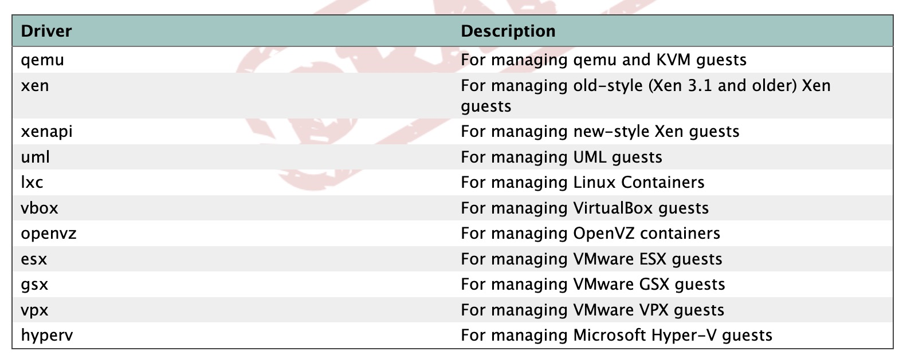

# Connections

Connection是所有操作和对象的基础。任何和libvirt交互的实体，都需要先获取connection。

### Connect
#### Open (Connect)
可读写connection
```
conn, _ := libvirt.Connect(uri)

```
只读connection，可以用于监控类型的应用
```
conn, _ := libvirt.ConnectReadOnly(uri)
```

使用auth的connection
```
func NewConnectWithAuth(uri string, auth *ConnectAuth, flags ConnectFlags) (*Connect, error)


type ConnectAuth struct {
	CredType []ConnectCredentialType
	Callback ConnectAuthCallback
}

type ConnectFlags uint
```

#### Close

使用引用计数法管理connections，任意类型的open都会将connection的计数+1

Close最好和Open成对出现

[comment]: # (但是我感觉go有gc的话，就算不显式释放似乎也没有什么大问题【存疑】。)


### URI Format

#### Local URIs
形如以下格式的URL都是Local URI，其他所有形式的URI都被视为remote的。
```
driver:///system
driver:///session
driver+unix:///system
driver+unix:///session
```

支持的driver：


Local URI的connect方式是
```
conn, _ := libvirt.NewConnect("qemu:///session")
defer conn.Close()

```

需要注意的是，有两种driver的connect方式有所差异：LXC driver和client-side-only driver.

##### LXC driver
```
conn, _ := libvirt.NewConnect("lxc://")
defer conn.Close()

```

##### Client-side-only driver
包括ESX, VPX, GPX, HyperV，这些driver不能使用远程传输机制（remote transport mechenisum。
```
conn, _ := libvirt.NewConnect("vpx://example-vcenter.com/dc1/srv1")
```
[comment]: # (这个地方目前不太好理解，没有实操环境。)


### Remote URIs
```
driver[+transport]://[username@][hostname][:port]/[path][?extraparameters]
```
详见[原文](https://libvirt.org/docs/libvirt-appdev-guide-python/en-US/html/libvirt_application_development_guide_using_python-Connections-Remote_URIs.html)


### Capability Information Methods
```
conn.GetCapabilities()
```

结果以一个XML的形式返回
<details>
  <summary>XML示例</summary>

```xml
<capabilities>
  <host>
    <uuid>65ed7346-2ad5-41b2-9122-33b852277855</uuid>
    <cpu>
      <arch>x86_64</arch>
      <model>Broadwell-noTSX-IBRS</model>
      <vendor>Intel</vendor>
      <topology sockets='1' dies='1' cores='8' threads='1'/>
      <feature name='vme'/>
      <feature name='ds'/>
      <feature name='acpi'/>
      <feature name='ss'/>
      <feature name='ht'/>
      <feature name='tm'/>
      <feature name='pbe'/>
      <feature name='dtes64'/>
      <feature name='monitor'/>
      <feature name='ds_cpl'/>
      <feature name='vmx'/>
      <feature name='est'/>
      <feature name='tm2'/>
      <feature name='xtpr'/>
      <feature name='pdcm'/>
      <feature name='osxsave'/>
      <feature name='f16c'/>
      <feature name='rdrand'/>
      <feature name='arat'/>
      <feature name='tsc_adjust'/>
      <feature name='avx512f'/>
      <feature name='avx512dq'/>
      <feature name='avx512ifma'/>
      <feature name='clflushopt'/>
      <feature name='intel-pt'/>
      <feature name='avx512cd'/>
      <feature name='sha-ni'/>
      <feature name='avx512bw'/>
      <feature name='avx512vl'/>
      <feature name='avx512vbmi'/>
      <feature name='umip'/>
      <feature name='pku'/>
      <feature name='avx512vbmi2'/>
      <feature name='gfni'/>
      <feature name='vaes'/>
      <feature name='vpclmulqdq'/>
      <feature name='avx512vnni'/>
      <feature name='avx512bitalg'/>
      <feature name='avx512-vpopcntdq'/>
      <feature name='rdpid'/>
      <feature name='fsrm'/>
      <feature name='md-clear'/>
      <feature name='stibp'/>
      <feature name='arch-capabilities'/>
      <feature name='ssbd'/>
      <feature name='xsaveopt'/>
      <feature name='xsavec'/>
      <feature name='xgetbv1'/>
      <feature name='xsaves'/>
      <feature name='pdpe1gb'/>
      <feature name='abm'/>
      <feature name='invtsc'/>
    </cpu>
    <power_management/>
    <iommu support='no'/>
    <migration_features>
      <live/>
      <uri_transports>
        <uri_transport>tcp</uri_transport>
        <uri_transport>rdma</uri_transport>
      </uri_transports>
    </migration_features>
    <topology>
      <cells num='1'>
        <cell id='0'>
          <memory unit='KiB'>2097152</memory>
          <cpus num='8'>
            <cpu id='0' socket_id='0' die_id='0' core_id='0' siblings='0'/>
            <cpu id='1' socket_id='0' die_id='0' core_id='1' siblings='1'/>
            <cpu id='2' socket_id='0' die_id='0' core_id='2' siblings='2'/>
            <cpu id='3' socket_id='0' die_id='0' core_id='3' siblings='3'/>
            <cpu id='4' socket_id='0' die_id='0' core_id='4' siblings='4'/>
            <cpu id='5' socket_id='0' die_id='0' core_id='5' siblings='5'/>
            <cpu id='6' socket_id='0' die_id='0' core_id='6' siblings='6'/>
            <cpu id='7' socket_id='0' die_id='0' core_id='7' siblings='7'/>
          </cpus>
        </cell>
      </cells>
    </topology>
    <secmodel>
      <model>none</model>
      <doi>0</doi>
    </secmodel>
  </host>

  <guest>
    <os_type>hvm</os_type>
    <arch name='alpha'>
      <wordsize>64</wordsize>
      <emulator>/usr/local/bin/qemu-system-alpha</emulator>
      <machine maxCpus='4'>clipper</machine>
      <domain type='qemu'/>
    </arch>
    <features>
      <cpuselection/>
      <deviceboot/>
      <disksnapshot default='on' toggle='no'/>
    </features>
  </guest>

  <guest>
    <os_type>hvm</os_type>
    <arch name='armv6l'>
      <wordsize>32</wordsize>
      <emulator>/usr/local/bin/qemu-system-arm</emulator>
      <machine maxCpus='1'>integratorcp</machine>
      <machine maxCpus='2'>ast2600-evb</machine>
      <machine maxCpus='1'>borzoi</machine>
      <machine maxCpus='1'>spitz</machine>
      <machine maxCpus='255'>virt-2.7</machine>
      <machine maxCpus='2'>nuri</machine>
      <machine maxCpus='2'>mcimx7d-sabre</machine>
      <machine maxCpus='1'>romulus-bmc</machine>
      <machine maxCpus='512'>virt-3.0</machine>
      <machine maxCpus='512'>virt-5.0</machine>
      <machine maxCpus='2'>npcm750-evb</machine>
      <machine maxCpus='255'>virt-2.10</machine>
      <machine maxCpus='2'>rainier-bmc</machine>
      <machine maxCpus='1'>mps3-an547</machine>
      <machine maxCpus='2'>musca-b1</machine>
      <machine maxCpus='4'>realview-pbx-a9</machine>
      <machine maxCpus='1'>versatileab</machine>
      <machine maxCpus='1'>kzm</machine>
      <machine maxCpus='255'>virt-2.8</machine>
      <machine maxCpus='2'>musca-a</machine>
      <machine maxCpus='512'>virt-3.1</machine>
      <machine maxCpus='1'>mcimx6ul-evk</machine>
      <machine maxCpus='512'>virt-5.1</machine>
      <machine maxCpus='2'>smdkc210</machine>
      <machine maxCpus='1'>sx1</machine>
      <machine maxCpus='255'>virt-2.11</machine>
      <machine maxCpus='1'>imx25-pdk</machine>
      <machine maxCpus='1'>stm32vldiscovery</machine>
      <machine maxCpus='255'>virt-2.9</machine>
      <machine maxCpus='4'>orangepi-pc</machine>
      <machine maxCpus='1'>quanta-q71l-bmc</machine>
      <machine maxCpus='1'>z2</machine>
      <machine maxCpus='512'>virt-5.2</machine>
      <machine maxCpus='1'>xilinx-zynq-a9</machine>
      <machine maxCpus='1'>tosa</machine>
      <machine maxCpus='1'>mps2-an500</machine>
      <machine maxCpus='255'>virt-2.12</machine>
      <machine maxCpus='2'>mps2-an521</machine>
      <machine maxCpus='4'>sabrelite</machine>
      <machine maxCpus='1'>mps2-an511</machine>
      <machine maxCpus='1'>canon-a1100</machine>
      <machine maxCpus='1'>realview-eb</machine>
      <machine maxCpus='2'>quanta-gbs-bmc</machine>
      <machine maxCpus='1'>emcraft-sf2</machine>
      <machine maxCpus='1'>realview-pb-a8</machine>
      <machine maxCpus='512'>virt-4.0</machine>
      <machine maxCpus='1'>raspi1ap</machine>
      <machine maxCpus='1'>palmetto-bmc</machine>
      <machine maxCpus='1'>sx1-v1</machine>
      <machine maxCpus='1'>n810</machine>
      <machine maxCpus='1'>g220a-bmc</machine>
      <machine maxCpus='1'>n800</machine>
      <machine maxCpus='2'>tacoma-bmc</machine>
      <machine maxCpus='512'>virt-4.1</machine>
      <machine maxCpus='2'>quanta-gsj</machine>
      <machine maxCpus='1'>versatilepb</machine>
      <machine maxCpus='1'>terrier</machine>
      <machine maxCpus='1'>mainstone</machine>
      <machine maxCpus='4'>realview-eb-mpcore</machine>
      <machine maxCpus='1'>supermicrox11-bmc</machine>
      <machine maxCpus='512'>virt-4.2</machine>
      <machine maxCpus='1'>witherspoon-bmc</machine>
      <machine maxCpus='2'>mps3-an524</machine>
      <machine maxCpus='1' deprecated='yes'>swift-bmc</machine>
      <machine maxCpus='4'>vexpress-a9</machine>
      <machine maxCpus='4'>midway</machine>
      <machine maxCpus='1'>musicpal</machine>
      <machine maxCpus='1'>lm3s811evb</machine>
      <machine maxCpus='1'>lm3s6965evb</machine>
      <machine maxCpus='1'>microbit</machine>
      <machine maxCpus='1'>mps2-an505</machine>
      <machine maxCpus='1'>mps2-an385</machine>
      <machine maxCpus='512'>virt-6.0</machine>
      <machine maxCpus='1'>cubieboard</machine>
      <machine maxCpus='1'>verdex</machine>
      <machine maxCpus='1'>netduino2</machine>
      <machine maxCpus='1'>mps2-an386</machine>
      <machine maxCpus='512'>virt-6.1</machine>
      <machine canonical='virt-6.1' maxCpus='512'>virt</machine>
      <machine maxCpus='4'>raspi2b</machine>
      <machine canonical='raspi2b' maxCpus='4'>raspi2</machine>
      <machine maxCpus='4'>vexpress-a15</machine>
      <machine maxCpus='1'>sonorapass-bmc</machine>
      <machine maxCpus='1'>cheetah</machine>
      <machine maxCpus='255'>virt-2.6</machine>
      <machine maxCpus='1'>ast2500-evb</machine>
      <machine maxCpus='4'>highbank</machine>
      <machine maxCpus='1'>akita</machine>
      <machine maxCpus='1'>connex</machine>
      <machine maxCpus='1'>netduinoplus2</machine>
      <machine maxCpus='1'>collie</machine>
      <machine maxCpus='1'>raspi0</machine>
      <domain type='qemu'/>
    </arch>
    <features>
      <cpuselection/>
      <deviceboot/>
      <disksnapshot default='on' toggle='no'/>
    </features>
  </guest>

  <guest>
    <os_type>hvm</os_type>
    <arch name='armv7l'>
      <wordsize>32</wordsize>
      <emulator>/usr/local/bin/qemu-system-arm</emulator>
      <machine maxCpus='1'>integratorcp</machine>
      <machine maxCpus='2'>ast2600-evb</machine>
      <machine maxCpus='1'>borzoi</machine>
      <machine maxCpus='1'>spitz</machine>
      <machine maxCpus='255'>virt-2.7</machine>
      <machine maxCpus='2'>nuri</machine>
      <machine maxCpus='2'>mcimx7d-sabre</machine>
      <machine maxCpus='1'>romulus-bmc</machine>
      <machine maxCpus='512'>virt-3.0</machine>
      <machine maxCpus='512'>virt-5.0</machine>
      <machine maxCpus='2'>npcm750-evb</machine>
      <machine maxCpus='255'>virt-2.10</machine>
      <machine maxCpus='2'>rainier-bmc</machine>
      <machine maxCpus='1'>mps3-an547</machine>
      <machine maxCpus='2'>musca-b1</machine>
      <machine maxCpus='4'>realview-pbx-a9</machine>
      <machine maxCpus='1'>versatileab</machine>
      <machine maxCpus='1'>kzm</machine>
      <machine maxCpus='255'>virt-2.8</machine>
      <machine maxCpus='2'>musca-a</machine>
      <machine maxCpus='512'>virt-3.1</machine>
      <machine maxCpus='1'>mcimx6ul-evk</machine>
      <machine maxCpus='512'>virt-5.1</machine>
      <machine maxCpus='2'>smdkc210</machine>
      <machine maxCpus='1'>sx1</machine>
      <machine maxCpus='255'>virt-2.11</machine>
      <machine maxCpus='1'>imx25-pdk</machine>
      <machine maxCpus='1'>stm32vldiscovery</machine>
      <machine maxCpus='255'>virt-2.9</machine>
      <machine maxCpus='4'>orangepi-pc</machine>
      <machine maxCpus='1'>quanta-q71l-bmc</machine>
      <machine maxCpus='1'>z2</machine>
      <machine maxCpus='512'>virt-5.2</machine>
      <machine maxCpus='1'>xilinx-zynq-a9</machine>
      <machine maxCpus='1'>tosa</machine>
      <machine maxCpus='1'>mps2-an500</machine>
      <machine maxCpus='255'>virt-2.12</machine>
      <machine maxCpus='2'>mps2-an521</machine>
      <machine maxCpus='4'>sabrelite</machine>
      <machine maxCpus='1'>mps2-an511</machine>
      <machine maxCpus='1'>canon-a1100</machine>
      <machine maxCpus='1'>realview-eb</machine>
      <machine maxCpus='2'>quanta-gbs-bmc</machine>
      <machine maxCpus='1'>emcraft-sf2</machine>
      <machine maxCpus='1'>realview-pb-a8</machine>
      <machine maxCpus='512'>virt-4.0</machine>
      <machine maxCpus='1'>raspi1ap</machine>
      <machine maxCpus='1'>palmetto-bmc</machine>
      <machine maxCpus='1'>sx1-v1</machine>
      <machine maxCpus='1'>n810</machine>
      <machine maxCpus='1'>g220a-bmc</machine>
      <machine maxCpus='1'>n800</machine>
      <machine maxCpus='2'>tacoma-bmc</machine>
      <machine maxCpus='512'>virt-4.1</machine>
      <machine maxCpus='2'>quanta-gsj</machine>
      <machine maxCpus='1'>versatilepb</machine>
      <machine maxCpus='1'>terrier</machine>
      <machine maxCpus='1'>mainstone</machine>
      <machine maxCpus='4'>realview-eb-mpcore</machine>
      <machine maxCpus='1'>supermicrox11-bmc</machine>
      <machine maxCpus='512'>virt-4.2</machine>
      <machine maxCpus='1'>witherspoon-bmc</machine>
      <machine maxCpus='2'>mps3-an524</machine>
      <machine maxCpus='1' deprecated='yes'>swift-bmc</machine>
      <machine maxCpus='4'>vexpress-a9</machine>
      <machine maxCpus='4'>midway</machine>
      <machine maxCpus='1'>musicpal</machine>
      <machine maxCpus='1'>lm3s811evb</machine>
      <machine maxCpus='1'>lm3s6965evb</machine>
      <machine maxCpus='1'>microbit</machine>
      <machine maxCpus='1'>mps2-an505</machine>
      <machine maxCpus='1'>mps2-an385</machine>
      <machine maxCpus='512'>virt-6.0</machine>
      <machine maxCpus='1'>cubieboard</machine>
      <machine maxCpus='1'>verdex</machine>
      <machine maxCpus='1'>netduino2</machine>
      <machine maxCpus='1'>mps2-an386</machine>
      <machine maxCpus='512'>virt-6.1</machine>
      <machine canonical='virt-6.1' maxCpus='512'>virt</machine>
      <machine maxCpus='4'>raspi2b</machine>
      <machine canonical='raspi2b' maxCpus='4'>raspi2</machine>
      <machine maxCpus='4'>vexpress-a15</machine>
      <machine maxCpus='1'>sonorapass-bmc</machine>
      <machine maxCpus='1'>cheetah</machine>
      <machine maxCpus='255'>virt-2.6</machine>
      <machine maxCpus='1'>ast2500-evb</machine>
      <machine maxCpus='4'>highbank</machine>
      <machine maxCpus='1'>akita</machine>
      <machine maxCpus='1'>connex</machine>
      <machine maxCpus='1'>netduinoplus2</machine>
      <machine maxCpus='1'>collie</machine>
      <machine maxCpus='1'>raspi0</machine>
      <domain type='qemu'/>
    </arch>
    <features>
      <cpuselection/>
      <deviceboot/>
      <disksnapshot default='on' toggle='no'/>
    </features>
  </guest>

  <guest>
    <os_type>hvm</os_type>
    <arch name='aarch64'>
      <wordsize>64</wordsize>
      <emulator>/usr/local/bin/qemu-system-aarch64</emulator>
      <machine maxCpus='1'>integratorcp</machine>
      <machine maxCpus='2'>ast2600-evb</machine>
      <machine maxCpus='1'>borzoi</machine>
      <machine maxCpus='1'>spitz</machine>
      <machine maxCpus='255'>virt-2.7</machine>
      <machine maxCpus='2'>nuri</machine>
      <machine maxCpus='2'>mcimx7d-sabre</machine>
      <machine maxCpus='1'>romulus-bmc</machine>
      <machine maxCpus='512'>virt-3.0</machine>
      <machine maxCpus='512'>virt-5.0</machine>
      <machine maxCpus='2'>npcm750-evb</machine>
      <machine maxCpus='255'>virt-2.10</machine>
      <machine maxCpus='2'>rainier-bmc</machine>
      <machine maxCpus='1'>mps3-an547</machine>
      <machine maxCpus='2'>musca-b1</machine>
      <machine maxCpus='4'>realview-pbx-a9</machine>
      <machine maxCpus='1'>versatileab</machine>
      <machine maxCpus='1'>kzm</machine>
      <machine maxCpus='255'>virt-2.8</machine>
      <machine maxCpus='2'>musca-a</machine>
      <machine maxCpus='512'>virt-3.1</machine>
      <machine maxCpus='1'>mcimx6ul-evk</machine>
      <machine maxCpus='512'>virt-5.1</machine>
      <machine maxCpus='2'>smdkc210</machine>
      <machine maxCpus='1'>sx1</machine>
      <machine maxCpus='255'>virt-2.11</machine>
      <machine maxCpus='1'>imx25-pdk</machine>
      <machine maxCpus='1'>stm32vldiscovery</machine>
      <machine maxCpus='255'>virt-2.9</machine>
      <machine maxCpus='4'>orangepi-pc</machine>
      <machine maxCpus='1'>quanta-q71l-bmc</machine>
      <machine maxCpus='1'>z2</machine>
      <machine maxCpus='512'>virt-5.2</machine>
      <machine maxCpus='1'>xilinx-zynq-a9</machine>
      <machine maxCpus='6'>xlnx-zcu102</machine>
      <machine maxCpus='1'>tosa</machine>
      <machine maxCpus='1'>mps2-an500</machine>
      <machine maxCpus='255'>virt-2.12</machine>
      <machine maxCpus='2'>mps2-an521</machine>
      <machine maxCpus='4'>sabrelite</machine>
      <machine maxCpus='1'>mps2-an511</machine>
      <machine maxCpus='1'>canon-a1100</machine>
      <machine maxCpus='1'>realview-eb</machine>
      <machine maxCpus='2'>quanta-gbs-bmc</machine>
      <machine maxCpus='1'>emcraft-sf2</machine>
      <machine maxCpus='1'>realview-pb-a8</machine>
      <machine maxCpus='512'>sbsa-ref</machine>
      <machine maxCpus='512'>virt-4.0</machine>
      <machine maxCpus='1'>raspi1ap</machine>
      <machine maxCpus='1'>palmetto-bmc</machine>
      <machine maxCpus='1'>sx1-v1</machine>
      <machine maxCpus='1'>n810</machine>
      <machine maxCpus='1'>g220a-bmc</machine>
      <machine maxCpus='2'>tacoma-bmc</machine>
      <machine maxCpus='1'>n800</machine>
      <machine maxCpus='512'>virt-4.1</machine>
      <machine maxCpus='2'>quanta-gsj</machine>
      <machine maxCpus='1'>versatilepb</machine>
      <machine maxCpus='1'>terrier</machine>
      <machine maxCpus='1'>mainstone</machine>
      <machine maxCpus='4'>realview-eb-mpcore</machine>
      <machine maxCpus='1'>supermicrox11-bmc</machine>
      <machine maxCpus='512'>virt-4.2</machine>
      <machine maxCpus='1'>witherspoon-bmc</machine>
      <machine maxCpus='2'>mps3-an524</machine>
      <machine maxCpus='1' deprecated='yes'>swift-bmc</machine>
      <machine maxCpus='4'>vexpress-a9</machine>
      <machine maxCpus='4'>midway</machine>
      <machine maxCpus='1'>musicpal</machine>
      <machine maxCpus='1'>lm3s811evb</machine>
      <machine maxCpus='1'>lm3s6965evb</machine>
      <machine maxCpus='1'>microbit</machine>
      <machine maxCpus='1'>mps2-an505</machine>
      <machine maxCpus='1'>mps2-an385</machine>
      <machine maxCpus='512'>virt-6.0</machine>
      <machine maxCpus='4'>raspi3ap</machine>
      <machine maxCpus='1'>cubieboard</machine>
      <machine maxCpus='1'>verdex</machine>
      <machine maxCpus='1'>netduino2</machine>
      <machine maxCpus='2'>xlnx-versal-virt</machine>
      <machine maxCpus='1'>mps2-an386</machine>
      <machine maxCpus='512'>virt-6.1</machine>
      <machine canonical='virt-6.1' maxCpus='512'>virt</machine>
      <machine maxCpus='4'>raspi3b</machine>
      <machine canonical='raspi3b' maxCpus='4'>raspi3</machine>
      <machine maxCpus='4'>raspi2b</machine>
      <machine canonical='raspi2b' maxCpus='4'>raspi2</machine>
      <machine maxCpus='4'>vexpress-a15</machine>
      <machine maxCpus='1'>sonorapass-bmc</machine>
      <machine maxCpus='1'>cheetah</machine>
      <machine maxCpus='255'>virt-2.6</machine>
      <machine maxCpus='1'>ast2500-evb</machine>
      <machine maxCpus='4'>highbank</machine>
      <machine maxCpus='1'>akita</machine>
      <machine maxCpus='1'>connex</machine>
      <machine maxCpus='1'>netduinoplus2</machine>
      <machine maxCpus='1'>collie</machine>
      <machine maxCpus='1'>raspi0</machine>
      <domain type='qemu'/>
    </arch>
    <features>
      <acpi default='on' toggle='yes'/>
      <cpuselection/>
      <deviceboot/>
      <disksnapshot default='on' toggle='no'/>
    </features>
  </guest>

  <guest>
    <os_type>hvm</os_type>
    <arch name='cris'>
      <wordsize>32</wordsize>
      <emulator>/usr/local/bin/qemu-system-cris</emulator>
      <machine maxCpus='1'>axis-dev88</machine>
      <domain type='qemu'/>
    </arch>
    <features>
      <cpuselection/>
      <deviceboot/>
      <disksnapshot default='on' toggle='no'/>
    </features>
  </guest>

  <guest>
    <os_type>hvm</os_type>
    <arch name='i686'>
      <wordsize>32</wordsize>
      <emulator>/usr/local/bin/qemu-system-i386</emulator>
      <machine maxCpus='255'>pc-i440fx-6.1</machine>
      <machine canonical='pc-i440fx-6.1' maxCpus='255'>pc</machine>
      <machine maxCpus='288'>pc-q35-5.2</machine>
      <machine maxCpus='255'>pc-i440fx-2.12</machine>
      <machine maxCpus='255'>pc-i440fx-2.0</machine>
      <machine maxCpus='288'>pc-q35-4.2</machine>
      <machine maxCpus='255'>pc-i440fx-2.5</machine>
      <machine maxCpus='255'>pc-i440fx-4.2</machine>
      <machine maxCpus='255'>pc-i440fx-5.2</machine>
      <machine maxCpus='255'>pc-i440fx-1.5</machine>
      <machine maxCpus='255'>pc-q35-2.7</machine>
      <machine maxCpus='255'>pc-i440fx-2.2</machine>
      <machine maxCpus='255'>pc-i440fx-2.7</machine>
      <machine maxCpus='288'>pc-q35-6.1</machine>
      <machine canonical='pc-q35-6.1' maxCpus='288'>q35</machine>
      <machine maxCpus='255'>pc-q35-2.4</machine>
      <machine maxCpus='288'>pc-q35-2.10</machine>
      <machine maxCpus='288'>pc-q35-5.1</machine>
      <machine maxCpus='255'>pc-i440fx-1.7</machine>
      <machine maxCpus='288'>pc-q35-2.9</machine>
      <machine maxCpus='255'>pc-i440fx-2.11</machine>
      <machine maxCpus='288'>pc-q35-3.1</machine>
      <machine maxCpus='288'>pc-q35-4.1</machine>
      <machine maxCpus='255'>pc-i440fx-2.4</machine>
      <machine maxCpus='255'>pc-i440fx-4.1</machine>
      <machine maxCpus='255'>pc-i440fx-5.1</machine>
      <machine maxCpus='255'>pc-i440fx-2.9</machine>
      <machine maxCpus='1'>isapc</machine>
      <machine maxCpus='255'>pc-i440fx-1.4</machine>
      <machine maxCpus='255'>pc-q35-2.6</machine>
      <machine maxCpus='255'>pc-i440fx-3.1</machine>
      <machine maxCpus='288'>pc-q35-2.12</machine>
      <machine maxCpus='255'>pc-i440fx-2.1</machine>
      <machine maxCpus='288'>pc-q35-6.0</machine>
      <machine maxCpus='255'>pc-i440fx-2.6</machine>
      <machine maxCpus='288'>pc-q35-4.0.1</machine>
      <machine maxCpus='255'>pc-i440fx-1.6</machine>
      <machine maxCpus='288'>pc-q35-5.0</machine>
      <machine maxCpus='288'>pc-q35-2.8</machine>
      <machine maxCpus='255'>pc-i440fx-2.10</machine>
      <machine maxCpus='288'>pc-q35-3.0</machine>
      <machine maxCpus='255'>pc-i440fx-6.0</machine>
      <machine maxCpus='288'>pc-q35-4.0</machine>
      <machine maxCpus='288'>microvm</machine>
      <machine maxCpus='255'>pc-i440fx-2.3</machine>
      <machine maxCpus='255'>pc-i440fx-4.0</machine>
      <machine maxCpus='255'>pc-i440fx-5.0</machine>
      <machine maxCpus='255'>pc-i440fx-2.8</machine>
      <machine maxCpus='255'>pc-q35-2.5</machine>
      <machine maxCpus='255'>pc-i440fx-3.0</machine>
      <machine maxCpus='288'>pc-q35-2.11</machine>
      <domain type='qemu'/>
    </arch>
    <features>
      <pae/>
      <nonpae/>
      <acpi default='on' toggle='yes'/>
      <apic default='on' toggle='no'/>
      <cpuselection/>
      <deviceboot/>
      <disksnapshot default='on' toggle='no'/>
    </features>
  </guest>

  <guest>
    <os_type>hvm</os_type>
    <arch name='m68k'>
      <wordsize>32</wordsize>
      <emulator>/usr/local/bin/qemu-system-m68k</emulator>
      <machine maxCpus='1'>mcf5208evb</machine>
      <machine maxCpus='1'>an5206</machine>
      <machine maxCpus='1'>virt-6.0</machine>
      <machine canonical='virt-6.0' maxCpus='1'>virt</machine>
      <machine maxCpus='1'>q800</machine>
      <machine maxCpus='1'>next-cube</machine>
      <domain type='qemu'/>
    </arch>
    <features>
      <cpuselection/>
      <deviceboot/>
      <disksnapshot default='on' toggle='no'/>
    </features>
  </guest>

  <guest>
    <os_type>hvm</os_type>
    <arch name='microblaze'>
      <wordsize>32</wordsize>
      <emulator>/usr/local/bin/qemu-system-microblaze</emulator>
      <machine maxCpus='1'>petalogix-s3adsp1800</machine>
      <machine maxCpus='1'>petalogix-ml605</machine>
      <machine maxCpus='1'>xlnx-zynqmp-pmu</machine>
      <domain type='qemu'/>
    </arch>
    <features>
      <cpuselection/>
      <deviceboot/>
      <disksnapshot default='on' toggle='no'/>
    </features>
  </guest>

  <guest>
    <os_type>hvm</os_type>
    <arch name='microblazeel'>
      <wordsize>32</wordsize>
      <emulator>/usr/local/bin/qemu-system-microblazeel</emulator>
      <machine maxCpus='1'>petalogix-s3adsp1800</machine>
      <machine maxCpus='1'>petalogix-ml605</machine>
      <machine maxCpus='1'>xlnx-zynqmp-pmu</machine>
      <domain type='qemu'/>
    </arch>
    <features>
      <cpuselection/>
      <deviceboot/>
      <disksnapshot default='on' toggle='no'/>
    </features>
  </guest>

  <guest>
    <os_type>hvm</os_type>
    <arch name='mips'>
      <wordsize>32</wordsize>
      <emulator>/usr/local/bin/qemu-system-mips</emulator>
      <machine maxCpus='16'>malta</machine>
      <machine maxCpus='1'>mipssim</machine>
      <domain type='qemu'/>
    </arch>
    <features>
      <cpuselection/>
      <deviceboot/>
      <disksnapshot default='on' toggle='no'/>
    </features>
  </guest>

  <guest>
    <os_type>hvm</os_type>
    <arch name='mipsel'>
      <wordsize>32</wordsize>
      <emulator>/usr/local/bin/qemu-system-mipsel</emulator>
      <machine maxCpus='16'>malta</machine>
      <machine maxCpus='1'>mipssim</machine>
      <domain type='qemu'/>
    </arch>
    <features>
      <cpuselection/>
      <deviceboot/>
      <disksnapshot default='on' toggle='no'/>
    </features>
  </guest>

  <guest>
    <os_type>hvm</os_type>
    <arch name='mips64'>
      <wordsize>64</wordsize>
      <emulator>/usr/local/bin/qemu-system-mips64</emulator>
      <machine maxCpus='16'>malta</machine>
      <machine maxCpus='1'>pica61</machine>
      <machine maxCpus='1'>mipssim</machine>
      <machine maxCpus='1'>magnum</machine>
      <domain type='qemu'/>
    </arch>
    <features>
      <cpuselection/>
      <deviceboot/>
      <disksnapshot default='on' toggle='no'/>
    </features>
  </guest>

  <guest>
    <os_type>hvm</os_type>
    <arch name='mips64el'>
      <wordsize>64</wordsize>
      <emulator>/usr/local/bin/qemu-system-mips64el</emulator>
      <machine maxCpus='16'>malta</machine>
      <machine maxCpus='1'>pica61</machine>
      <machine maxCpus='16'>loongson3-virt</machine>
      <machine maxCpus='1'>mipssim</machine>
      <machine maxCpus='1'>fuloong2e</machine>
      <machine maxCpus='16'>boston</machine>
      <machine maxCpus='1'>magnum</machine>
      <domain type='qemu'/>
    </arch>
    <features>
      <cpuselection/>
      <deviceboot/>
      <disksnapshot default='on' toggle='no'/>
    </features>
  </guest>

  <guest>
    <os_type>hvm</os_type>
    <arch name='ppc'>
      <wordsize>32</wordsize>
      <emulator>/usr/local/bin/qemu-system-ppc</emulator>
      <machine maxCpus='1'>g3beige</machine>
      <machine maxCpus='1'>virtex-ml507</machine>
      <machine maxCpus='1'>mac99</machine>
      <machine maxCpus='32'>ppce500</machine>
      <machine maxCpus='1'>sam460ex</machine>
      <machine maxCpus='1'>pegasos2</machine>
      <machine maxCpus='1'>bamboo</machine>
      <machine maxCpus='1'>40p</machine>
      <machine maxCpus='1'>ref405ep</machine>
      <machine maxCpus='15'>mpc8544ds</machine>
      <machine maxCpus='1'>taihu</machine>
      <domain type='qemu'/>
    </arch>
    <features>
      <cpuselection/>
      <deviceboot/>
      <disksnapshot default='on' toggle='no'/>
    </features>
  </guest>

  <guest>
    <os_type>hvm</os_type>
    <arch name='ppc64'>
      <wordsize>64</wordsize>
      <emulator>/usr/local/bin/qemu-system-ppc64</emulator>
      <machine maxCpus='2147483647'>pseries-6.1</machine>
      <machine canonical='pseries-6.1' maxCpus='2147483647'>pseries</machine>
      <machine maxCpus='2048'>powernv9</machine>
      <machine canonical='powernv9' maxCpus='2048'>powernv</machine>
      <machine maxCpus='1'>taihu</machine>
      <machine maxCpus='2147483647'>pseries-4.1</machine>
      <machine maxCpus='15'>mpc8544ds</machine>
      <machine maxCpus='2147483647'>pseries-2.5</machine>
      <machine maxCpus='2048'>powernv10</machine>
      <machine maxCpus='2147483647'>pseries-4.2</machine>
      <machine maxCpus='2147483647'>pseries-2.6</machine>
      <machine maxCpus='32'>ppce500</machine>
      <machine maxCpus='2147483647'>pseries-2.7</machine>
      <machine maxCpus='2147483647'>pseries-3.0</machine>
      <machine maxCpus='2147483647'>pseries-5.0</machine>
      <machine maxCpus='1'>40p</machine>
      <machine maxCpus='2147483647'>pseries-2.8</machine>
      <machine maxCpus='1'>pegasos2</machine>
      <machine maxCpus='2147483647'>pseries-3.1</machine>
      <machine maxCpus='2147483647'>pseries-5.1</machine>
      <machine maxCpus='2147483647'>pseries-2.9</machine>
      <machine maxCpus='1'>bamboo</machine>
      <machine maxCpus='1'>g3beige</machine>
      <machine maxCpus='2147483647'>pseries-5.2</machine>
      <machine maxCpus='2147483647'>pseries-2.12-sxxm</machine>
      <machine maxCpus='2147483647'>pseries-2.10</machine>
      <machine maxCpus='1'>virtex-ml507</machine>
      <machine maxCpus='2147483647'>pseries-2.11</machine>
      <machine maxCpus='2147483647'>pseries-2.1</machine>
      <machine maxCpus='2147483647'>pseries-2.12</machine>
      <machine maxCpus='2147483647'>pseries-2.2</machine>
      <machine maxCpus='1'>mac99</machine>
      <machine maxCpus='1'>sam460ex</machine>
      <machine maxCpus='1'>ref405ep</machine>
      <machine maxCpus='2147483647'>pseries-2.3</machine>
      <machine maxCpus='2048'>powernv8</machine>
      <machine maxCpus='2147483647'>pseries-4.0</machine>
      <machine maxCpus='2147483647'>pseries-6.0</machine>
      <machine maxCpus='2147483647'>pseries-2.4</machine>
      <domain type='qemu'/>
    </arch>
    <features>
      <cpuselection/>
      <deviceboot/>
      <disksnapshot default='on' toggle='no'/>
    </features>
  </guest>

  <guest>
    <os_type>hvm</os_type>
    <arch name='ppc64le'>
      <wordsize>64</wordsize>
      <emulator>/usr/local/bin/qemu-system-ppc64</emulator>
      <machine maxCpus='2147483647'>pseries-6.1</machine>
      <machine canonical='pseries-6.1' maxCpus='2147483647'>pseries</machine>
      <machine maxCpus='2048'>powernv9</machine>
      <machine canonical='powernv9' maxCpus='2048'>powernv</machine>
      <machine maxCpus='1'>taihu</machine>
      <machine maxCpus='2147483647'>pseries-4.1</machine>
      <machine maxCpus='15'>mpc8544ds</machine>
      <machine maxCpus='2147483647'>pseries-2.5</machine>
      <machine maxCpus='2048'>powernv10</machine>
      <machine maxCpus='2147483647'>pseries-4.2</machine>
      <machine maxCpus='2147483647'>pseries-2.6</machine>
      <machine maxCpus='32'>ppce500</machine>
      <machine maxCpus='2147483647'>pseries-2.7</machine>
      <machine maxCpus='2147483647'>pseries-3.0</machine>
      <machine maxCpus='2147483647'>pseries-5.0</machine>
      <machine maxCpus='1'>40p</machine>
      <machine maxCpus='2147483647'>pseries-2.8</machine>
      <machine maxCpus='1'>pegasos2</machine>
      <machine maxCpus='2147483647'>pseries-3.1</machine>
      <machine maxCpus='2147483647'>pseries-5.1</machine>
      <machine maxCpus='2147483647'>pseries-2.9</machine>
      <machine maxCpus='1'>bamboo</machine>
      <machine maxCpus='1'>g3beige</machine>
      <machine maxCpus='2147483647'>pseries-5.2</machine>
      <machine maxCpus='2147483647'>pseries-2.12-sxxm</machine>
      <machine maxCpus='2147483647'>pseries-2.10</machine>
      <machine maxCpus='1'>virtex-ml507</machine>
      <machine maxCpus='2147483647'>pseries-2.11</machine>
      <machine maxCpus='2147483647'>pseries-2.1</machine>
      <machine maxCpus='2147483647'>pseries-2.12</machine>
      <machine maxCpus='2147483647'>pseries-2.2</machine>
      <machine maxCpus='1'>mac99</machine>
      <machine maxCpus='1'>sam460ex</machine>
      <machine maxCpus='1'>ref405ep</machine>
      <machine maxCpus='2147483647'>pseries-2.3</machine>
      <machine maxCpus='2048'>powernv8</machine>
      <machine maxCpus='2147483647'>pseries-4.0</machine>
      <machine maxCpus='2147483647'>pseries-6.0</machine>
      <machine maxCpus='2147483647'>pseries-2.4</machine>
      <domain type='qemu'/>
    </arch>
    <features>
      <cpuselection/>
      <deviceboot/>
      <disksnapshot default='on' toggle='no'/>
    </features>
  </guest>

  <guest>
    <os_type>hvm</os_type>
    <arch name='riscv32'>
      <wordsize>32</wordsize>
      <emulator>/usr/local/bin/qemu-system-riscv32</emulator>
      <machine maxCpus='8'>spike</machine>
      <machine maxCpus='1'>opentitan</machine>
      <machine maxCpus='5'>sifive_u</machine>
      <machine maxCpus='1'>sifive_e</machine>
      <machine maxCpus='8'>virt</machine>
      <domain type='qemu'/>
    </arch>
    <features>
      <cpuselection/>
      <deviceboot/>
      <disksnapshot default='on' toggle='no'/>
    </features>
  </guest>

  <guest>
    <os_type>hvm</os_type>
    <arch name='riscv64'>
      <wordsize>64</wordsize>
      <emulator>/usr/local/bin/qemu-system-riscv64</emulator>
      <machine maxCpus='8'>spike</machine>
      <machine maxCpus='5'>microchip-icicle-kit</machine>
      <machine maxCpus='5'>sifive_u</machine>
      <machine maxCpus='1'>shakti_c</machine>
      <machine maxCpus='1'>sifive_e</machine>
      <machine maxCpus='8'>virt</machine>
      <domain type='qemu'/>
    </arch>
    <features>
      <cpuselection/>
      <deviceboot/>
      <disksnapshot default='on' toggle='no'/>
    </features>
  </guest>

  <guest>
    <os_type>hvm</os_type>
    <arch name='s390x'>
      <wordsize>64</wordsize>
      <emulator>/usr/local/bin/qemu-system-s390x</emulator>
      <machine maxCpus='248'>s390-ccw-virtio-6.1</machine>
      <machine canonical='s390-ccw-virtio-6.1' maxCpus='248'>s390-ccw-virtio</machine>
      <machine maxCpus='248'>s390-ccw-virtio-4.0</machine>
      <machine maxCpus='248'>s390-ccw-virtio-5.2</machine>
      <machine maxCpus='248'>s390-ccw-virtio-3.1</machine>
      <machine maxCpus='248'>s390-ccw-virtio-2.6</machine>
      <machine maxCpus='248'>s390-ccw-virtio-2.12</machine>
      <machine maxCpus='248'>s390-ccw-virtio-2.9</machine>
      <machine maxCpus='248'>s390-ccw-virtio-6.0</machine>
      <machine maxCpus='248'>s390-ccw-virtio-5.1</machine>
      <machine maxCpus='248'>s390-ccw-virtio-3.0</machine>
      <machine maxCpus='248'>s390-ccw-virtio-4.2</machine>
      <machine maxCpus='248'>s390-ccw-virtio-2.5</machine>
      <machine maxCpus='248'>s390-ccw-virtio-2.11</machine>
      <machine maxCpus='248'>s390-ccw-virtio-2.8</machine>
      <machine maxCpus='248'>s390-ccw-virtio-5.0</machine>
      <machine maxCpus='248'>s390-ccw-virtio-4.1</machine>
      <machine maxCpus='248'>s390-ccw-virtio-2.4</machine>
      <machine maxCpus='248'>s390-ccw-virtio-2.10</machine>
      <machine maxCpus='248'>s390-ccw-virtio-2.7</machine>
      <domain type='qemu'/>
    </arch>
    <features>
      <cpuselection/>
      <deviceboot/>
      <disksnapshot default='on' toggle='no'/>
    </features>
  </guest>

  <guest>
    <os_type>hvm</os_type>
    <arch name='sh4'>
      <wordsize>32</wordsize>
      <emulator>/usr/local/bin/qemu-system-sh4</emulator>
      <machine maxCpus='1'>shix</machine>
      <machine maxCpus='1'>r2d</machine>
      <domain type='qemu'/>
    </arch>
    <features>
      <cpuselection/>
      <deviceboot/>
      <disksnapshot default='on' toggle='no'/>
    </features>
  </guest>

  <guest>
    <os_type>hvm</os_type>
    <arch name='sh4eb'>
      <wordsize>64</wordsize>
      <emulator>/usr/local/bin/qemu-system-sh4eb</emulator>
      <machine maxCpus='1'>shix</machine>
      <machine maxCpus='1'>r2d</machine>
      <domain type='qemu'/>
    </arch>
    <features>
      <cpuselection/>
      <deviceboot/>
      <disksnapshot default='on' toggle='no'/>
    </features>
  </guest>

  <guest>
    <os_type>hvm</os_type>
    <arch name='sparc'>
      <wordsize>32</wordsize>
      <emulator>/usr/local/bin/qemu-system-sparc</emulator>
      <machine maxCpus='1'>SS-5</machine>
      <machine maxCpus='4'>SS-20</machine>
      <machine maxCpus='1'>LX</machine>
      <machine maxCpus='1'>SPARCClassic</machine>
      <machine maxCpus='1'>leon3_generic</machine>
      <machine maxCpus='1'>SPARCbook</machine>
      <machine maxCpus='1'>SS-4</machine>
      <machine maxCpus='4'>SS-600MP</machine>
      <machine maxCpus='4'>SS-10</machine>
      <machine maxCpus='1'>Voyager</machine>
      <domain type='qemu'/>
    </arch>
    <features>
      <cpuselection/>
      <deviceboot/>
      <disksnapshot default='on' toggle='no'/>
    </features>
  </guest>

  <guest>
    <os_type>hvm</os_type>
    <arch name='sparc64'>
      <wordsize>64</wordsize>
      <emulator>/usr/local/bin/qemu-system-sparc64</emulator>
      <machine maxCpus='1'>sun4u</machine>
      <machine maxCpus='1'>niagara</machine>
      <machine maxCpus='1'>sun4v</machine>
      <domain type='qemu'/>
    </arch>
    <features>
      <cpuselection/>
      <deviceboot/>
      <disksnapshot default='on' toggle='no'/>
    </features>
  </guest>

  <guest>
    <os_type>hvm</os_type>
    <arch name='x86_64'>
      <wordsize>64</wordsize>
      <emulator>/usr/local/bin/qemu-system-x86_64</emulator>
      <machine maxCpus='255'>pc-i440fx-6.1</machine>
      <machine canonical='pc-i440fx-6.1' maxCpus='255'>pc</machine>
      <machine maxCpus='288'>pc-q35-5.2</machine>
      <machine maxCpus='255'>pc-i440fx-2.12</machine>
      <machine maxCpus='255'>pc-i440fx-2.0</machine>
      <machine maxCpus='288'>pc-q35-4.2</machine>
      <machine maxCpus='255'>pc-i440fx-2.5</machine>
      <machine maxCpus='255'>pc-i440fx-4.2</machine>
      <machine maxCpus='255'>pc-i440fx-5.2</machine>
      <machine maxCpus='255'>pc-i440fx-1.5</machine>
      <machine maxCpus='255'>pc-q35-2.7</machine>
      <machine maxCpus='255'>pc-i440fx-2.2</machine>
      <machine maxCpus='255'>pc-i440fx-2.7</machine>
      <machine maxCpus='288'>pc-q35-6.1</machine>
      <machine canonical='pc-q35-6.1' maxCpus='288'>q35</machine>
      <machine maxCpus='255'>pc-q35-2.4</machine>
      <machine maxCpus='288'>pc-q35-2.10</machine>
      <machine maxCpus='255'>pc-i440fx-1.7</machine>
      <machine maxCpus='288'>pc-q35-5.1</machine>
      <machine maxCpus='288'>pc-q35-2.9</machine>
      <machine maxCpus='255'>pc-i440fx-2.11</machine>
      <machine maxCpus='288'>pc-q35-3.1</machine>
      <machine maxCpus='288'>pc-q35-4.1</machine>
      <machine maxCpus='255'>pc-i440fx-2.4</machine>
      <machine maxCpus='255'>pc-i440fx-4.1</machine>
      <machine maxCpus='255'>pc-i440fx-5.1</machine>
      <machine maxCpus='255'>pc-i440fx-2.9</machine>
      <machine maxCpus='1'>isapc</machine>
      <machine maxCpus='255'>pc-i440fx-1.4</machine>
      <machine maxCpus='255'>pc-q35-2.6</machine>
      <machine maxCpus='255'>pc-i440fx-3.1</machine>
      <machine maxCpus='288'>pc-q35-2.12</machine>
      <machine maxCpus='255'>pc-i440fx-2.1</machine>
      <machine maxCpus='288'>pc-q35-6.0</machine>
      <machine maxCpus='255'>pc-i440fx-2.6</machine>
      <machine maxCpus='288'>pc-q35-4.0.1</machine>
      <machine maxCpus='255'>pc-i440fx-1.6</machine>
      <machine maxCpus='288'>pc-q35-5.0</machine>
      <machine maxCpus='288'>pc-q35-2.8</machine>
      <machine maxCpus='255'>pc-i440fx-2.10</machine>
      <machine maxCpus='288'>pc-q35-3.0</machine>
      <machine maxCpus='255'>pc-i440fx-6.0</machine>
      <machine maxCpus='288'>pc-q35-4.0</machine>
      <machine maxCpus='288'>microvm</machine>
      <machine maxCpus='255'>pc-i440fx-2.3</machine>
      <machine maxCpus='255'>pc-i440fx-4.0</machine>
      <machine maxCpus='255'>pc-i440fx-5.0</machine>
      <machine maxCpus='255'>pc-i440fx-2.8</machine>
      <machine maxCpus='255'>pc-q35-2.5</machine>
      <machine maxCpus='255'>pc-i440fx-3.0</machine>
      <machine maxCpus='288'>pc-q35-2.11</machine>
      <domain type='qemu'/>
    </arch>
    <features>
      <acpi default='on' toggle='yes'/>
      <apic default='on' toggle='no'/>
      <cpuselection/>
      <deviceboot/>
      <disksnapshot default='on' toggle='no'/>
    </features>
  </guest>

  <guest>
    <os_type>hvm</os_type>
    <arch name='xtensa'>
      <wordsize>32</wordsize>
      <emulator>/usr/local/bin/qemu-system-xtensa</emulator>
      <machine maxCpus='4'>sim</machine>
      <machine maxCpus='32'>kc705</machine>
      <machine maxCpus='32'>ml605</machine>
      <machine maxCpus='32'>ml605-nommu</machine>
      <machine maxCpus='32'>virt</machine>
      <machine maxCpus='32'>lx60-nommu</machine>
      <machine maxCpus='32'>lx200</machine>
      <machine maxCpus='32'>lx200-nommu</machine>
      <machine maxCpus='32'>lx60</machine>
      <machine maxCpus='32'>kc705-nommu</machine>
      <domain type='qemu'/>
    </arch>
    <features>
      <cpuselection/>
      <deviceboot/>
      <disksnapshot default='on' toggle='no'/>
    </features>
  </guest>

  <guest>
    <os_type>hvm</os_type>
    <arch name='xtensaeb'>
      <wordsize>32</wordsize>
      <emulator>/usr/local/bin/qemu-system-xtensaeb</emulator>
      <machine maxCpus='4'>sim</machine>
      <machine maxCpus='32'>kc705</machine>
      <machine maxCpus='32'>ml605</machine>
      <machine maxCpus='32'>ml605-nommu</machine>
      <machine maxCpus='32'>virt</machine>
      <machine maxCpus='32'>lx60-nommu</machine>
      <machine maxCpus='32'>lx200</machine>
      <machine maxCpus='32'>lx200-nommu</machine>
      <machine maxCpus='32'>lx60</machine>
      <machine maxCpus='32'>kc705-nommu</machine>
      <domain type='qemu'/>
    </arch>
    <features>
      <cpuselection/>
      <deviceboot/>
      <disksnapshot default='on' toggle='no'/>
    </features>
  </guest>

</capabilities>
```
</details>

在返回的XML中，总是存在

* **一个**/host子文档（sub-document），用于表示host的capability。
* **零个或者多个**/guest子文档，每一个/guest子文档都表示host上可以启动的guest类型。guests是guest的arch（i686）和ABI（hvm，xen）的组合。

##### host
比较简单的内容参考上述XML示例，这里只记录若干：
* /host/topology：host的NUMA topology，每一个NUMA node都使用/host/topology/cells/cell表示哪些CPU位于该NUMA node下。当host是UMA（non-NUMA）时，只会有一个cell，所有的CPU都会在该cell下。
* 
##### guest
比较简单的内容参考上述XML示例，这里只记录若干：

* /guest/arch/loader：guest type的firmware loader的默认路径，会被/guest/arch/domain/loader覆盖。
* /guest/arch/machine：描述guest emulator可以emulate的默认机器类型，pc表示PCI based PC，isapc表示ISA based PC。


### Host Information
使用connection获取host的信息，包括hostname，maximum supported guest CPUs等。

#### GetNodeInfo()
```go
func (c *Connect) GetNodeInfo() (*NodeInfo, error)

type NodeInfo struct {
	Model   string // CPU型号
	Memory  uint64 // 内存大小（MB）
	Cpus    uint   // active CPU数量
	MHz     uint   // CPU频率
	Nodes   uint32 // NUMA node数
	Sockets uint32 // 每个NUMA node的socket数
	Cores   uint32 // 每个socket的core数
	Threads uint32 // 每个core的thread数

}
```
#### GetCellsFreeMemory
```go
func (c *Connect) GetCellsFreeMemory(startCell int, maxCells int) ([]uint64, error) 
```

#### GetVersion

分为libvirt library version和driver supported version，格式为1000000 * major + 1000 * minor + release。

```go
libvirt.GetVersion() // 7007000,7.7
libvirt.VERSION_NUMBER // 7007000,7.7

conn.GetVersion() // 6001000, 6.1
```

#### GetFreePages
```go
func (c *Connect) GetFreePages(pageSizes []uint64, startCell int, maxCells uint, flags uint32) ([]uint64, error)
```

```go
pageSize := []uint64{4, 2048} // 单位是KB，4 for 4K（普通页），2048 for 2M（大页），看到官网还有一个1048576 for 1G.

	fmt.Println(conn.GetFreePages(pageSize, 0, 1, 0))

```
在Mac平台上似乎获取不到页信息，还挺可惜的，报错如下。
```shell
virError(Code=84, Domain=0, Message='Operation not supported: page info is not supported on this platform')
```